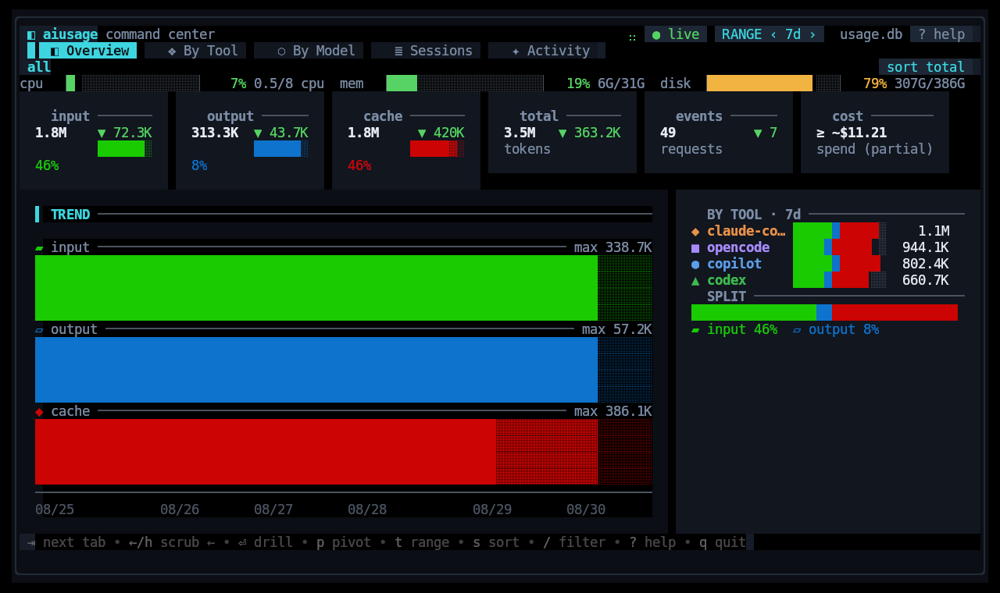

# aiusage

**One local dashboard for the tokens, cost, and activity from your AI coding tools.**

  

Real aiusage dashboard, captured with synthetic demo data.

## What it does

`aiusage` finds the usage records your coding agents already keep and turns
them into one searchable history.

- See tokens and cost for today, this week, or any date range.
- Compare tools, models, providers, projects, and sessions.
- Explore tool calls, file changes, commands, searches, and other agent activity.
- Keep historical totals even after an agent compacts or removes a transcript.
- Use the terminal dashboard, plain-text reports, JSON, CSV, or the Go packages.

Your source files are read-only. Running collection again is safe: observations
that were already recorded are not counted twice.

## Install

Download a ready-to-run archive for Linux or macOS from
[GitHub Releases](https://github.com/RandomCodeSpace/aiusage/releases).

If you have Go 1.25.13 or newer:

~~~console
go install github.com/RandomCodeSpace/aiusage@latest
~~~

Release builds support Linux and macOS on amd64 and arm64. Windows is not
currently supported.

## First run

Check which tools and data sources are available:

~~~console
aiusage doctor
~~~

Import everything that is already on this machine:

~~~console
aiusage once
~~~

Then choose a view:

~~~console
aiusage today    # quick report for today
aiusage          # interactive dashboard
~~~

`doctor` explains missing or unreadable sources and prints setup help when a
tool needs it. GitHub Copilot, for example, needs its OpenTelemetry file
exporter enabled before token data is available.

## Supported tools

Antigravity · Claude Code · Cline · Codex · Crush · DSH · GitHub Copilot ·
Goose · Hermes · Kimi Code · OpenClaw · opencode · Pi · Qwen Code · Reasonix

Coverage varies because each tool records different information. Some provide
exact cost and detailed activity; others provide token totals only. Run
`aiusage doctor` to see what is available on your machine.

Antigravity currently exposes token totals only in noninteractive stream JSON.
To track those runs, append the stream to one stable file:

~~~console
mkdir -p "$HOME/.gemini/antigravity-cli"
agy --print "YOUR PROMPT" --output-format stream-json \
  | tee -a "$HOME/.gemini/antigravity-cli/aiusage-stream.jsonl"
~~~

Keep continued turns in that same file. `aiusage doctor` prints this reminder;
ordinary Antigravity conversations cannot be recovered retroactively because
their saved artifacts do not contain token counters.

## Reading the numbers

Cost markers keep incomplete data honest:

| Marker | Meaning |
|---|---|
| `$` | Cost reported directly by the tool |
| `~$` | Cost estimated from the model price table |
| `≥` | Some usage could not be priced, so the total is a minimum |
| `-` | No known cost is available |

Activity dimensions overlap. A single agent turn can read a file, run a
command, and call another tool, so activity columns should not be added
together as one total.

In Sessions, drill through OpenCode, model and project, then select a session
to see its recorded lines added and removed. These are lifetime session totals from saved turn snapshots, across
models and outside the selected date range. Counts refresh when OpenCode
revises a snapshot; they are not a repository diff or a measure of authored
code. Missing snapshots and unsupported tools show unknown; partial totals
are marked. No source text or patches are stored for this feature.

## Everyday commands

| Command | What it gives you |
|---|---|
| `aiusage` | Interactive terminal dashboard |
| `aiusage serve` | Local web dashboard with live updates, at http://127.0.0.1:8930 |
| `aiusage today` | Today's totals |
| `aiusage last 2d` | A rolling time window |
| `aiusage summary` | Filtered and grouped reports |
| `aiusage once` | One collection pass, then exit |
| `aiusage sources` | Discovered source files and their status |
| `aiusage doctor` | Setup and health checks |
| `aiusage export` | JSON or CSV export |
| `aiusage db` | Back up, verify, restore, or safely reset the database |
| `aiusage setup` | Install background collection |
| `aiusage version` | Build identity |

Examples:

~~~console
aiusage last 2d
aiusage summary --since 7d --by day,tool,model --breakdown
aiusage summary --since 2026-08-01 --until 2026-09-01 --by provider --json
aiusage export --since 30d --format csv --out usage.csv
~~~

Run `aiusage <command> --help` for every option.

## Dashboard controls

| Key | Action |
|---|---|
| `1` to `5` | Switch between Overview, Tools, Models, Sessions, and Activity |
| `Tab` | Move to the next view |
| `t` | Change the time range |
| `[` / `]` | Move the time window backward or forward |
| `p` | Change the Overview or Activity pivot |
| `/` | Search or filter the current view |
| `s` | Change sorting |
| `Enter` / `Esc` | Open or close details |
| `r` | Refresh |
| `q` | Quit |

The footer always shows the controls available in the current view.

## Keep collection running

Opening the dashboard or a report such as `aiusage summary` ensures a
collector is running, unless `--no-daemon` is set. The collector is detached,
so quitting the dashboard leaves it running at its default five-minute
interval. The dashboard itself reads the database read-only. Use
`aiusage setup` to keep the collector running through your service manager.

On Linux with systemd, `aiusage setup` installs a user service without
`sudo`. On macOS, it installs a LaunchAgent that starts when you sign in and
runs until you sign out. Neither option needs administrator access.

If your system cannot use its native service manager, aiusage falls back to a
detached collector. That fallback stops when you sign out or restart. Opening
a report starts it again, or use `aiusage run` for foreground collection.

For manual control:

~~~console
aiusage run             # foreground collector
aiusage once            # collect once
aiusage                 # dashboard; starts a collector if none is running
aiusage --no-daemon     # dashboard only; starts nothing
aiusage --no-daemon summary  # report without starting a collector
~~~

Only one collector writes to a database at a time.

## Protect your history

Create a complete backup while collection keeps running:

~~~console
aiusage db backup
~~~

Check the live database or any backup without changing it:

~~~console
aiusage db verify
aiusage db verify /path/to/backup.db
~~~

`aiusage db restore BACKUP --replace` validates a staging copy and creates a
safety backup before replacing an existing database. If no usable backup
exists, `aiusage db reset --quarantine` preserves the database and its SQLite
sidecars before starting fresh. Neither command silently discards the old
files.

## Configuration

No configuration file is required. When present, it lives at
`~/.config/aiusage/config.json` (or the matching XDG config directory).

A small personal setup might look like this:

~~~json
{
  "interval_seconds": 300,
  "privacy": {
    "no_raw": true
  },
  "pricing": {
    "refresh": false
  }
}
~~~

Common overrides:

- `AIUSAGE_HOME` changes the aiusage data directory.
- `AIUSAGE_DB` changes the database path.
- `AIUSAGE_INTERVAL` changes the collector interval.
- `--db`, `--config`, and `--interval` override one command.
- `source_roots` in the config file adds non-standard source locations.

The default database is `~/.local/share/aiusage/usage.db`. Run
`aiusage doctor` to print the exact paths in use.

## Privacy and network access

- aiusage only reads the coding-tool records it discovers.
- It writes its own database, config, lock, cache, and log files.
- Raw metadata is limited to an allowlist of supported fields.
- `privacy.no_raw` prevents new raw metadata from being stored; it does not
  erase metadata already in the database.
- Normal reports and exports do not include raw metadata.

Token collection itself is local. When pricing refresh is enabled, aiusage may
download price tables from LiteLLM and Models.dev. Both have JSON snapshots
embedded in the binary, so pricing works offline without a first download.
Models.dev refreshes at most once every 24 hours while the collector runs and
falls back to its embedded snapshot if the refresh fails. A fresh local cache
is reused across restarts. Set `pricing.refresh` to `false` to disable downloads.

When rates become available for an older unpriced request, collection fills in
its estimated cost automatically in batches. Already priced requests keep
their original costs. Token counts and request identities stay unchanged, and
the saved price source identifies the rates used for each estimate. Models.dev
prices are provider-specific catalog estimates, including community rates where
official prices are unavailable. Confirmed free models are recorded as zero;
missing prices remain unpriced.

<strong>Use aiusage from Go</strong>

`aiusage` also exposes the components used by the CLI:

| Package | Purpose |
|---|---|
| `model` | Usage, activity, turn-context, capability, and cost types |
| `adapter` | Read-only adapter interfaces, source descriptors, and registries |
| `adapter/all` | Built-in adapter registry |
| `collect` | One-shot and interval-based collection |
| `store` | SQLite storage and query API |
| `pricing` | Bundled and refreshable model prices |

Open an existing database with `store.OpenReadOnly`. Use `store.Open` only
for collection or migrations, then call `collect.RunOnce` or `collect.Run`.

The [Go compatibility promise](./docs/compatibility.md) defines the supported
packages and upgrade rules. Scripts consuming JSON or CSV should follow the
[machine output contract](./docs/export-contract.md).

API documentation is available on
[pkg.go.dev](https://pkg.go.dev/github.com/RandomCodeSpace/aiusage).

<strong>Build and test</strong>

~~~console
go build ./...
go test ./...
go vet ./...
gofmt -l .
~~~

Release binaries are built with CGO disabled.

## Versioning

The project uses semantic version tags. Database migrations are automatic and
forward-only, so back up the database before opening it with an older build.
`v0.5.0` is the first compatibility baseline for the public Go packages and
the existing JSON and CSV formats. Those contracts remain compatible through
the v1 release line. See the [compatibility promise](./docs/compatibility.md)
for the patch, minor, and database migration rules.

## License

[MIT](./LICENSE)
